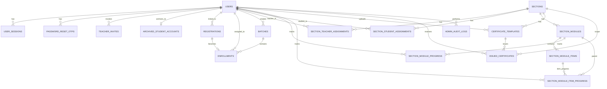

# Database Schema (Current System)

This version is for the current system design only (paper-ready), focused on the active section-based LMS and active account/enrollment flows.

Excluded from this document: legacy module-based reporting/content tables that are not part of the current target design.

## ER Diagram

## Tables

### Accounts and Access

- `users`
  Columns: `id` (PK), `username` (UK), `password_hash`, `role`, `first_name`, `middle_name`, `last_name`, `company_name`, `email`, `phone_number`, `address`, `birth_date`, `profile_image_path`, `must_change_password`, `archived_at`, `created_at`.
- `user_sessions`
  Columns: `id` (PK), `user_id` (FK `users.id`), `token` (UK), `created_at`, `expires_at`.
- `password_reset_otps`
  Columns: `id` (PK), `user_id` (FK `users.id`), `otp_hash`, `attempt_count`, `created_at`, `expires_at`, `verified_at`, `reset_token_hash`, `consumed_at`.
- `teacher_invites`
  Columns: `id` (PK), `invite_code` (UK), `label`, `passkey_hash`, `status`, `use_count`, `max_use_count`, `expires_at`, `last_used_at`, `revoked_at`, `revoked_by_user_id` (FK `users.id`), `revoked_reason`, `created_at`, `updated_at`.
- `archived_student_accounts`
  Columns: `id` (PK), `original_user_id` (FK `users.id`, UK), `original_username`, `original_email`, `first_name`, `middle_name`, `last_name`, `company_name`, `phone_number`, `address`, `birth_date`, `profile_image_path`, `role`, `enrollment_id`, `registration_id`, `batch_id`, `archive_reason`, `archived_at`.

### Registration and Enrollment

- `registrations`
  Columns: `id` (PK), `first_name`, `middle_name`, `last_name`, `birth_date`, `address`, `email`, `phone_number`, `reference_number`, `reference_image_path`, `status`, `validated_at`, `validated_by`, `linked_user_id` (FK `users.id`), `issued_username`, `notes`, `created_at`.
- `batches`
  Columns: `id` (PK), `code` (UK), `name` (UK), `status`, `start_date`, `end_date`, `capacity`, `notes`, `created_by_user_id` (FK `users.id`), `created_at`, `updated_at`.
- `enrollments`
  Columns: `id` (PK), `registration_id` (FK `registrations.id`, UK), `user_id` (FK `users.id`), `batch_id` (FK `batches.id`), `status`, `payment_review_status`, `review_notes`, `rejection_reason_code`, `rejection_reason_detail`, `reviewed_at`, `approved_at`, `approved_by_user_id` (FK `users.id`), `rejected_at`, `rejected_by_user_id` (FK `users.id`), `created_at`, `updated_at`.

### Section-Based LMS

- `sections`
  Columns: `id` (PK), `code` (UK), `name` (UK), `description`, `status`, `created_by_user_id` (FK `users.id`), `created_at`, `updated_at`.
- `section_teacher_assignments`
  Columns: `id` (PK), `section_id` (FK `sections.id`), `teacher_id` (FK `users.id`), `assigned_at`.
  Constraints: unique (`section_id`, `teacher_id`).
- `section_student_assignments`
  Columns: `id` (PK), `section_id` (FK `sections.id`), `student_id` (FK `users.id`), `assigned_at`, `course_completed_at`, `auto_archive_due_at`.
  Constraints: unique (`section_id`, `student_id`), unique (`student_id`).
- `section_modules`
  Columns: `id` (PK), `section_id` (FK `sections.id`), `title`, `description`, `order_index`, `is_published`, `created_by_teacher_id` (FK `users.id`), `created_at`, `updated_at`.
  Constraints: unique (`section_id`, `order_index`).
- `section_module_items`
  Columns: `id` (PK), `section_module_id` (FK `section_modules.id`), `title`, `item_type`, `order_index`, `instructions`, `content_text`, `config` (JSON), `is_required`, `is_published`, `created_at`, `updated_at`.
  Constraints: unique (`section_module_id`, `order_index`).
- `section_module_progress`
  Columns: `id` (PK), `student_id` (FK `users.id`), `section_module_id` (FK `section_modules.id`), `status`, `progress_percent`, `completed_items`, `total_items`, `last_completed_item_order`, `updated_at`.
  Constraints: unique (`student_id`, `section_module_id`).
- `section_module_item_progress`
  Columns: `id` (PK), `student_id` (FK `users.id`), `section_module_id` (FK `section_modules.id`), `section_module_item_id` (FK `section_module_items.id`), `status`, `response_text`, `is_correct`, `score_percent`, `attempt_count`, `duration_seconds`, `submitted_payload` (JSON), `started_at`, `completed_at`, `updated_at`.
  Constraints: unique (`student_id`, `section_module_item_id`).

### Certificates and Audit

- `certificate_templates`
  Columns: `id` (PK), `section_id` (FK `sections.id`), `uploaded_by_teacher_id` (FK `users.id`), `original_file_name`, `file_path`, `status`, `review_remarks`, `approved_by_user_id` (FK `users.id`), `approved_at`, `created_at`.
- `issued_certificates`
  Columns: `id` (PK), `template_id` (FK `certificate_templates.id`), `section_id` (FK `sections.id`), `student_id` (FK `users.id`), `issued_at`.
  Constraints: unique (`template_id`, `student_id`).
- `admin_audit_logs`
  Columns: `id` (PK), `admin_user_id` (FK `users.id`), `action_type`, `target_type`, `target_id`, `details` (JSON), `created_at`.
